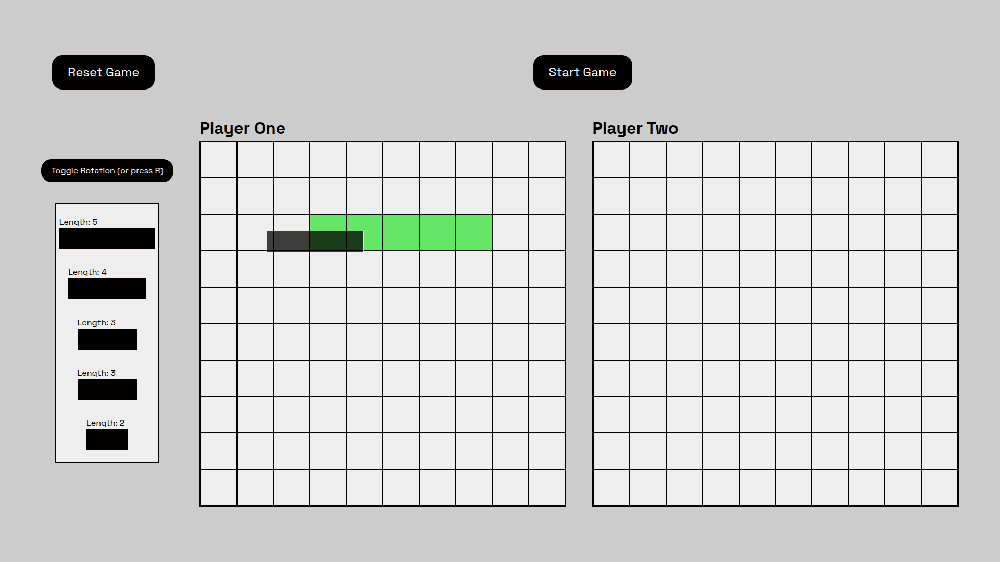
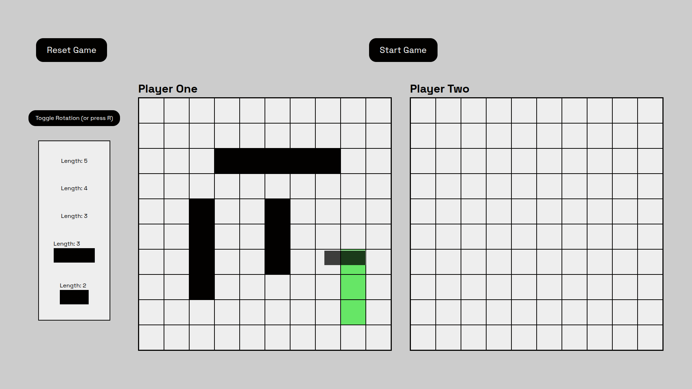
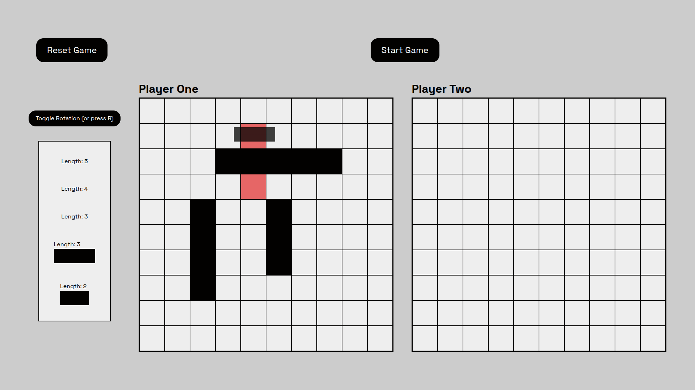
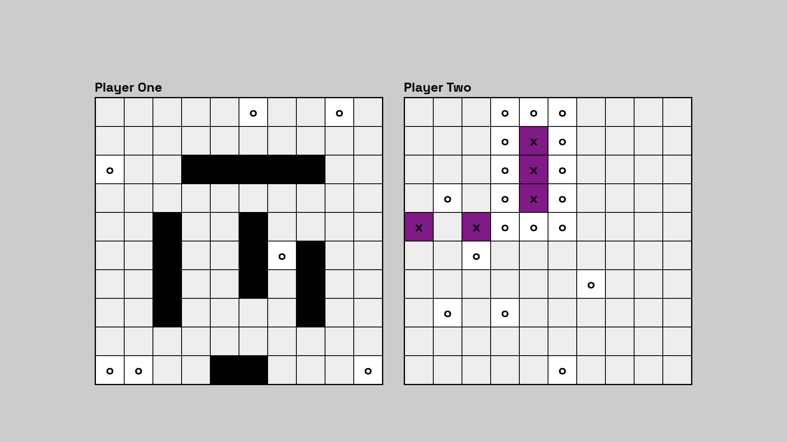
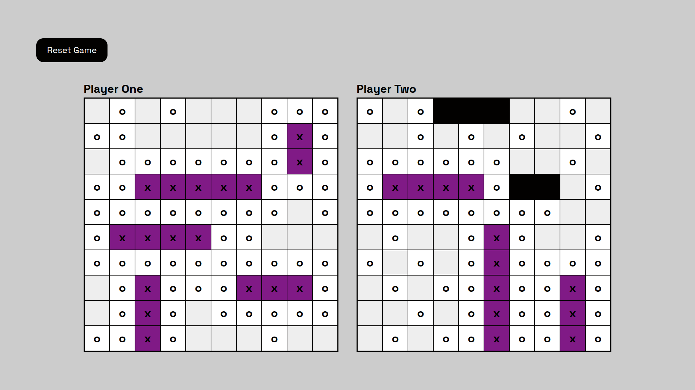

# Battleship

Project created for **[Project Odin](https://www.theodinproject.com/lessons/node-path-javascript-battleship)**

## Features 
**Drag and drop** all your ships onto battlefield.

**Rotate** ships orientation by **pressing R** or **toggling button**.

In case of **illegal placement** cells will become **red**.

Place **all** your ships on the battlefield. Then proceed to the game by clicking **start button**.
To fire a missile click on enemy board's cell.
After sinking ship all cells around it will be marked, because placement ship there is not possible. 
Computer will make **random** choice untill something is hit, then it will try to sink the ship it struck.

After lost game unsunken ships will become visible. 

## Live Preview 

To see this website live click this [Link](https://devoid-of-thought.github.io/odin-battleship/)